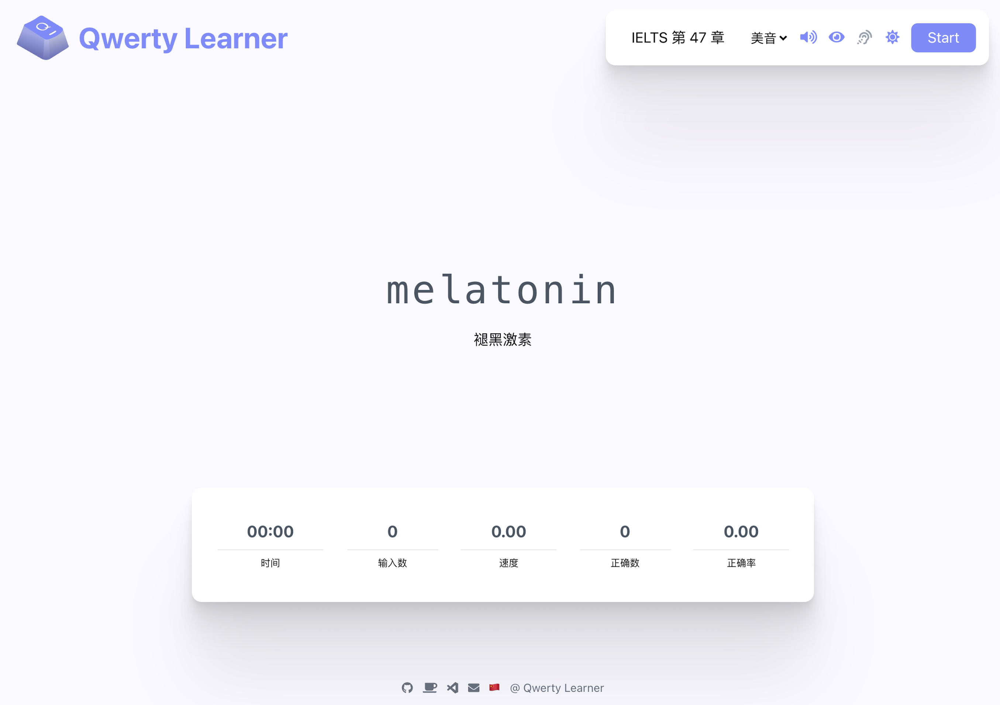

<div align=center>

</div>

<h1 align="center">
  Qwerty Learner
</h1>

<p align="center">
  为键盘工作者设计的单词记忆与肌肉记忆锻炼软件
</p>

<p align="center" style="display: flex; justify-content: center; gap: 10px;">
  <a href="https://github.com/kuhung/qwerty-learner/blob/master/LICENSE"></a>
  <a></a>
  <a></a>
</p>

<div align=center>

</div>

## 📖 目录

- [📸 在线访问](#-在线访问)
- [🚀 快速开始](#-快速开始)
  - [Vercel 部署](#vercel-部署)
  - [本地运行](#本地运行)
- [✨ 核心功能](#-核心功能)
  - [设计理念](#设计理念)
  - [功能概览](#功能概览)
- [📚 词库介绍](#-词库介绍)
  - [内置词库](#内置词库)
  - [API 词库](#api-词库)
- [🤝 贡献指南](#-贡献指南)
- [✨ 项目灵感](#-项目灵感)

## 📸 在线访问

https://tap.kuhung.me/

## 🚀 快速开始

### Vercel 部署

[](https://vercel.com/new/clone?repository-url=https%3A%2F%2Fgithub.com%2FRealKai42%2Fqwerty-learner)

#### 部署步骤

1. 更新 `Vercel Build & Development Settings` -> `Output Directory`："build"
2. 点击 Deploy Button

### 本地运行

本项目是基于 `React` 开发的，需要 Node.js 环境来运行。

#### 环境准备

1. Node.js
2. Git
3. Yarn

> **验证环境**
>
> 1. **手动验证**：在命令行中执行以下命令，检查版本输出：
>
>    ```sh
>    node --version
>    git --version
>    yarn --version
>    ```
>
> 2. **脚本验证（推荐）**：使用我们提供的脚本自动检查并安装依赖：
>
>    - Windows 用户：执行 [scripts/pre-check.ps1](scripts/pre-check.ps1)
>    - macOS 用户：执行 [scripts/pre-check.sh](scripts/pre-check.sh)
>
> 如果缺少环境，可参考官方文档安装：
>
> - [Node.js](https://nodejs.org/en/download)
> - [Git](https://git-scm.com/downloads)
> - [Yarn](https://classic.yarnpkg.com/lang/en/docs/install)

#### 手动安装与启动

1. 克隆项目：

   ```sh
   git clone https://github.com/kuhung/qwerty-learner.git
   cd qwerty-learner
   ```

2. 安装依赖：

   ```sh
   yarn install
   ```

3. 启动项目：

   ```sh
   yarn start
   ```

   项目将默认运行在 `http://localhost:5173/`。第一次本地启动时，需要授权开启本地数据存储权限，在地址栏右边的位置。否则表现为无图像。

#### 脚本一键安装与启动

- **Windows 用户**：直接执行 [scripts/install.ps1](scripts/install.ps1) 脚本。

  1. 打开 PowerShell，进入项目根目录的 `scripts` 目录。
  2. 执行 `.\install.ps1`。

  > **注意**：脚本依赖 `winget` 安装 Node.js，仅支持 Windows 10 1709 (版本 16299) 或更高版本。

- **macOS 用户**：直接执行 [scripts/install.sh](scripts/install.sh) 脚本。

  1. 打开终端，进入项目根目录。
  2. 执行 `scripts/install.sh`。

  > **注意**：脚本依赖 `homebrew`，请确保您的电脑已安装 `brew`。

## ✨ 核心功能

### 设计理念

Qwerty Learner 专为以英语作为主要工作语言的键盘工作者设计。我们发现，许多人在输入母语时打字速度更快，这是因为多年的母语输入形成了坚固的肌肉记忆。然而，英语输入的肌肉记忆相对较弱，容易出现"提笔忘字"的现象。

本软件将英语单词记忆与英语键盘输入肌肉记忆的锻炼相结合，旨在帮助用户在背诵单词的同时，巩固和强化英语输入的肌肉记忆。为避免形成错误的肌肉记忆，软件设计中若用户单词输入错误，则需要重新输入，确保用户始终保持正确的肌肉记忆。

本软件也对需要机考英语的用户有辅助作用。

**面向程序员**：

内置了程序员工作常用单词词库，方便练习工作中常用单词，提高输入速度。同时，也内置了多种编程语言 API 练习，帮助程序员快速熟悉常用 API。更多语言的 API 正在逐步添加中...

<div align=center>

</div>

### 功能概览

- **词库丰富**：内置 CET-4、CET-6、GMAT、GRE、IELTS、SAT、TOEFL、考研英语、专业四级英语、专业八级英语，以及程序员常见英语单词和多种编程语言 API 等。欢迎社区贡献更多词库。
- **音标显示与发音**：辅助用户在记忆单词时，同时记忆读音与音标。
  <div align=center>
  
  </div>
- **默写模式**：完成章节练习后可选择默写本章单词，巩固学习效果。
  <div align=center>
  
  </div>
- **速度与正确率显示**：量化用户输入速度和正确率，直观了解技能提升。
  <div align=center>
  
  </div>

## 📚 词库介绍

### 内置词库

- CET-4
- CET-6
- GMAT
- GRE
- IELTS
- SAT
- TOEFL
- 考研英语
- 专业四级英语
- 专业八级英语
- Coder Dict 程序员常用词
- 高考
- 中考
- 商务英语
- BEC
- 人教版英语 3-9 年级
- 王陆雅思王听力语料库 [@Saigyouji_WKKun](https://github.com/ggehuliang)
- 日语常见词、N1 ～ N5 [@xiaojia](https://github.com/wetery)
- 哈萨克语基础 3000 词(哈拼版) 来源于 [@Elgar](https://github.com/Elgar17) 由 [@Herbert He](https://github.com/HerbertHe) 通过 [哈拼](https://ha-pin.js.org) 技术支持

如果您需要其他词库，欢迎在 Issue 中提出。

### API 词库

- JavaScript API. [@sdu-gyf](https://github.com/sdu-gyf)
- Node.js API. [@chrysalis1215](https://github.com/chrysalis1215)
- Java API. [@darkSheep](https://github.com/SFAfreshman)
- Linux Command. [@归谜](https://github.com/vhxubo)
- C#: List API [@nidbCN](https://github.com/nidbCN)

目前 API 相关词库主要依赖于社区贡献。如果您想贡献自己的 API 词库，建议参考 [Issue #42](https://github.com/Realkai42/qwerty-learner/issues/40) 和 [PR #67](https://github.com/Realkai42/qwerty-learner/pull/67)。

## 🤝 贡献指南

- **贡献代码**：
  - [贡献准则](./docs/CONTRIBUTING.md)
- **贡献词库**：
  - [导入词典](./docs/toBuildDict.md)

## ✨ 项目灵感

原始项目：https://github.com/RealKai42/qwerty-learner 提供了非常好的项目模版。但对于本人来说，过分冗杂。太多其他语种和社群营销信息。

本人的基本需求包含雅思、日语以及其他语种的学习，强调通过相关考试。且部分 bug 影响体验，发布排期不明。综上拉出此分支，做出调整变更。

本项目仍然遵循 GPL3.0 协议，现已开源，未来项目的修改版本也应在 GPL3.0 开源许可下发布。

最后再次感谢原项目的众多贡献者。
